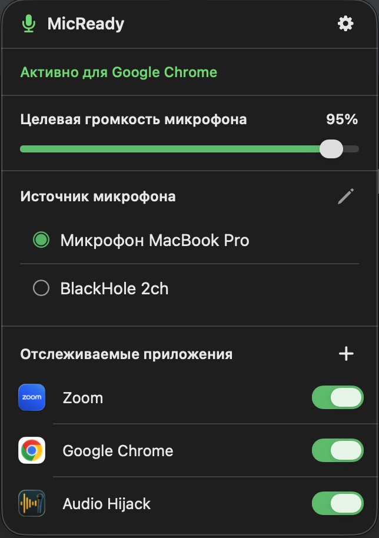

# StableMic


Приложение для menu bar macOS, которое автоматически поддерживает выбранную громкость микрофона всё время, пока запущено.

## Требования

- macOS 13.0+
- Xcode 15+

## Сборка и установка в «Программы»

### Через Terminal

Из корня проекта выполни:

```bash
xcodebuild \
  -project StableMic.xcodeproj \
  -scheme StableMic \
  -configuration Release \
  -destination 'platform=macOS' \
  -derivedDataPath /tmp/StableMicBuild \
  CODE_SIGNING_ALLOWED=NO \
  build

ditto \
  /tmp/StableMicBuild/Build/Products/Release/StableMic.app \
  /Applications/StableMic.app
```

После успешной сборки приложение появится в Finder → «Программы» (`/Applications/StableMic.app`). Запустить его можно оттуда или командой:

```bash
open /Applications/StableMic.app
```

Если Terminal сообщит, что для записи в `/Applications` недостаточно прав, повтори только команду `ditto` с `sudo`.

### Через Xcode

1. Открой `StableMic.xcodeproj` в Xcode
2. Выбери таргет `StableMic`
3. В настройках Signing & Capabilities — укажи свой Apple ID (бесплатный достаточно)
4. Выбери Product → Archive
5. В открывшемся Organizer нажми Distribute App → Copy App
6. Сохрани `StableMic.app`, затем перенеси его в Finder → «Программы»

Для обычной отладки можно использовать `Cmd+R`: Xcode соберёт и запустит приложение, но не установит его в папку «Программы».

### Live reload

Запусти из корня проекта:

```bash
./dev.sh
```

Перед запуском останови текущую сессию Xcode кнопкой Stop. Скрипт отслеживает изменения исходников и настроек проекта, автоматически пересобирает и перезапускает StableMic. Зависший экземпляр будет принудительно завершён, а одновременный запуск двух watcher-процессов заблокирован. Ошибка сборки не останавливает наблюдение: после следующего сохранения будет выполнена новая попытка. Для остановки нажми `Ctrl+C`.

## Добавление в автозапуск

После первого запуска: Настройки macOS → Основные → Объекты входа → добавь StableMic.app

## Как работает

- Каждые 2 секунды восстанавливает выбранную громкость микрофона
- При выборе конкретного источника в интерфейсе переключает системный input device macOS на этот микрофон
- Поддерживает выбранную громкость микрофона через CoreAudio API всё время работы
- Целевую громкость можно выбрать в popover с помощью горизонтального ползунка с шагом 5%
- Настройки сохраняются в UserDefaults между запусками
- Иконка в menu bar показывает текущий статус (зелёная = активен)

## Структура файлов

```
StableMic/
├── StableMicApp.swift             # Точка входа
├── AppDelegate.swift              # Menu bar иконка и popover
├── MicrophoneMonitor.swift        # Оркестрация мониторинга
├── Models/
│   └── AudioInputDevice.swift     # Модель входного аудиоустройства
├── Services/
│   ├── AudioDeviceService.swift   # CoreAudio операции
│   └── SettingsStore.swift        # Persistence через UserDefaults
├── Settings/
│   ├── AppSettings.swift          # Настройки и локализация
│   └── LocalizedText.swift        # Ключи локализованных строк
├── Views/
│   ├── ContentView.swift          # Root container интерфейса
│   ├── Main/
│   │   ├── HeaderView.swift
│   │   ├── VolumeControlView.swift
│   └── Settings/
│       └── SettingsView.swift
└── StableMic.entitlements         # Права доступа к аудио
```

## Известные ограничения

- Некоторые USB/Bluetooth микрофоны не поддерживают программное управление громкостью через CoreAudio — в этом случае приложение не сможет изменить громкость аппаратно
- Если AGC в Zoom/Teams очень агрессивный, рекомендуется также отключить его в настройках самого приложения
